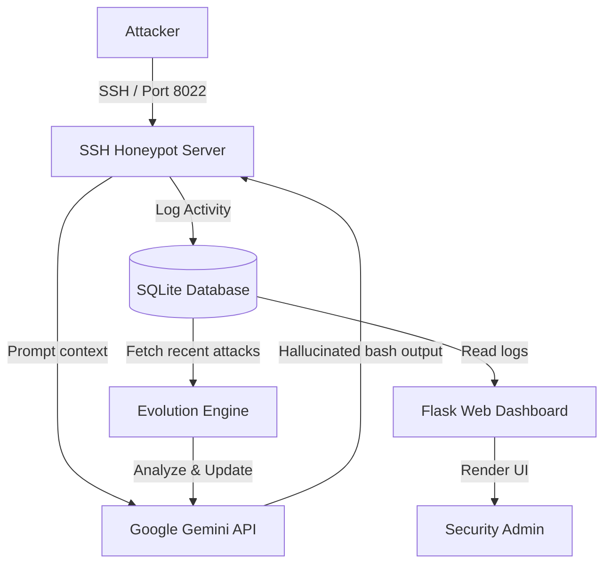

# Self-Evolving AI Honeypot

> A dynamic, AI-driven SSH honeypot that actively hallucinates fake environments to deceive and analyze attackers in real-time.


*[Screenshot/GIF Placeholder: Sci-Fi Web Dashboard showing live attacks]*

## Problem Statement & Core Features

Traditional honeypots are static and easily identifiable by modern attackers. The **Self-Evolving AI Honeypot** solves this by actively generating a dynamic persona, tricking hackers into revealing their tools and methods. By analyzing attacker behavior, it evolves to bait them deeper into the simulated environment, providing unprecedented threat intelligence.

### Core Features
* **Dynamic AI Persona (Gemini API):** Hallucinates a realistic Ubuntu 22.04 environment on the fly, creating fake `.env` files, password lists, and bash responses based on attacker inputs.
* **Sci-Fi Web Dashboard:** An interactive, visually stunning interface to monitor global attacks, featuring a live threat feed and geographical tracking.
* **Evolution Engine:** Continuously analyzes recent attacks to improve the honeypot's persona, making it progressively more enticing to future intruders.

## System Architecture & Data Flow



### Architectural Decisions
1. **Dynamic LLM Generation:** Instead of hardcoding a fake filesystem, we use the Google Gemini API to interpret attacker commands and generate realistic, context-aware responses on the fly.
2. **Decoupled Architecture:** The SSH server and the Web Dashboard run as separate processes but share a lightweight SQLite database, ensuring that heavy traffic on the honeypot doesn't crash the dashboard.
3. **Automated Evolution:** An independent evolution engine periodically analyzes captured threat data to adapt the honeypot's persona, making it a "living" trap.

---

## Original Content: AI-Powered SSH Honeypot
<details>
<summary>Click to view the original documentation</summary>

# AI-Powered SSH Honeypot

This is a dynamic, AI-powered SSH honeypot that tricks attackers into thinking they have compromised a real production server. It hallucinates a fake Linux environment (Ubuntu 22.04), responds to bash commands in real-time using Google Gemini, and logs all attacker activity into a beautifully designed Sci-Fi Web Dashboard.

## Features
- **Dynamic Persona:** The server hallucinates realistic files like `.env` and `passwords.txt` based on what attackers are searching for.
- **Sci-Fi Web Dashboard:** Watch attacks happen in real-time on a global map and a live threat feed.
- **Evolution Engine:** The honeypot analyzes recent attacks and evolves its persona to bait future hackers even better.

## Prerequisites
- Python 3.9+
- A Google Gemini API Key

## Setup & Installation

1. **Extract the ZIP file** to a folder on your computer.
2. **Open a terminal/command prompt** in that folder.
3. **Create a virtual environment:**
   ```bash
   python -m venv venv
   ```
4. **Activate the virtual environment:**
   - **Windows:** `.\venv\Scripts\activate`
   - **Mac/Linux:** `source venv/bin/activate`
5. **Install dependencies:**
   ```bash
   pip install -r requirements.txt
   ```
6. **Set up your API Key:**
   - Open the `.env` file (create it if it doesn't exist).
   - Add your Gemini API key:
     ```
     GEMINI_API_KEY="your_api_key_here"
     ```

## How to Run Locally

You need to run two scripts simultaneously in two separate terminals (make sure the virtual environment is activated in both).

**Terminal 1 (Start the SSH Server):**
```bash
python server.py
```

**Terminal 2 (Start the Web Dashboard):**
```bash
python web_app.py
```

Now, open your web browser and go to `http://localhost:5000` to view the dashboard!

## How to Test the Honeypot Locally
Open a third terminal and pretend to be a hacker:
```bash
ssh root@localhost -p 8022
```
(You can use any password you want, the honeypot will let you in!)
Try typing `ls -la`, `whoami`, or `cat .env` and watch the AI hallucinate the responses while the dashboard logs your every move.

## Exposing the Honeypot to the Internet
If you want to trick real hackers or have your friends attack your honeypot over the internet, you can use an SSH tunneling service.

### Method 1: Pinggy (Easiest - No Account Required)
Pinggy allows you to expose the honeypot instantly without downloading any software or creating an account.
1. Open a new terminal and run:
   ```bash
   ssh -p 443 -R0:localhost:8022 tcp@a.pinggy.io
   ```
2. Pinggy will give you a public TCP URL and port (e.g., `tcp.pinggy.io:45312`).
3. Send this address to your friend to attack your honeypot:
   ```bash
   ssh root@tcp.pinggy.io -p 45312
   ```

### Method 2: Ngrok
If you prefer Ngrok (requires a free account and a credit/debit card on file for identity verification):
1. Download and install [Ngrok](https://ngrok.com/).
2. Authenticate your account: `ngrok config add-authtoken <YOUR_TOKEN>`
3. Start the TCP tunnel:
   ```bash
   ngrok tcp 8022
   ```
4. Ngrok will output a URL like `tcp://0.tcp.ngrok.io:12345`.
5. Have your friend connect via: `ssh root@0.tcp.ngrok.io -p 12345`

### Method 3: AWS Cloud Server (Not Recommended for Beginners)
If you want to capture the true, real-world Public IP addresses of attackers (instead of `127.0.0.1` from tunnels), you can host the Honeypot directly on an AWS EC2 instance.
* **Warning:** This method requires setting up an AWS account, managing billing, configuring VPC Security Groups to expose port 8022, and running the Python environment headlessly via SSH. 
* Only use this method if you are comfortable managing Linux cloud infrastructure.
</details>
